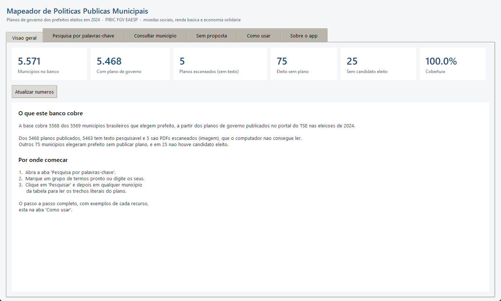
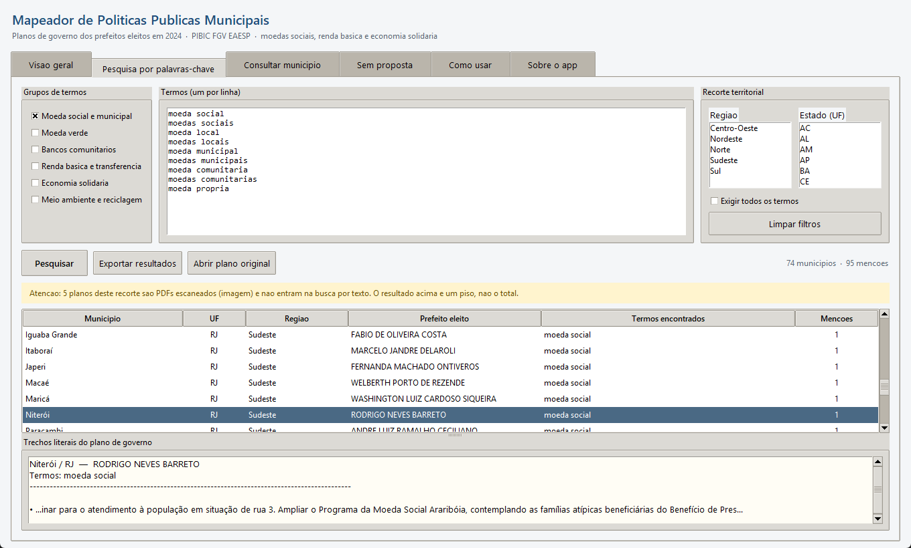
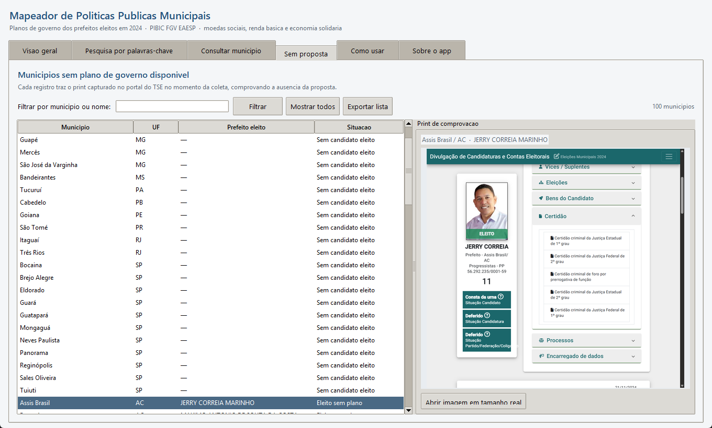

# Mapeador de Políticas Públicas Municipais

Aplicativo de busca sobre os planos de governo entregues ao Tribunal Superior
Eleitoral. Reúne, em uma única base pesquisável, a proposta de governo de todos
os prefeitos eleitos no Brasil em 2024 e a de todos os candidatos a governador e
a presidente que registraram proposta em 2026.

A pergunta que originou o projeto é simples de enunciar e difícil de responder à
mão: **quantos e quais municípios brasileiros prometeram moeda social no plano de
governo?** Responder exigia ler 5.468 documentos em PDF. O aplicativo faz essa
leitura em poucos segundos e devolve, junto com a contagem, o trecho literal de
cada plano, para que a afirmação possa ser conferida.

---

## Sumário

1. [Para que serve](#1-para-que-serve)
2. [Onde este projeto já foi usado](#2-onde-este-projeto-já-foi-usado)
3. [O que mudou na versão 3.0](#3-o-que-mudou-na-versão-30)
4. [Requisitos](#4-requisitos)
5. [Como instalar](#5-como-instalar)
6. [Rodar a partir do código-fonte](#6-rodar-a-partir-do-código-fonte)
7. [Como usar o aplicativo](#7-como-usar-o-aplicativo)
8. [Ferramentas de linha de comando](#8-ferramentas-de-linha-de-comando)
9. [Estrutura do repositório](#9-estrutura-do-repositório)
10. [O que há na base](#10-o-que-há-na-base)
11. [Limitações conhecidas](#11-limitações-conhecidas)
12. [Solução de problemas](#12-solução-de-problemas)
13. [Origem, créditos e citação](#13-origem-créditos-e-citação)

---

## 1. Para que serve

Todo candidato a prefeito, a governador e a presidente é obrigado por lei a
registrar uma proposta de governo junto à Justiça Eleitoral (Lei 9.504 de 1997,
artigo 11, parágrafo 1º, inciso IX). Esses documentos são públicos e ficam
disponíveis no portal do TSE, um a um, em PDF. Não existe busca por conteúdo:
para saber se um município prometeu determinada política, é preciso abrir o
arquivo e ler.

Este projeto resolve esse problema em duas etapas.

**Coleta.** Um robô de navegação percorre o portal do TSE e baixa a proposta de
cada candidato, organizando os arquivos por região, estado e município.

**Consulta.** Os PDFs são convertidos em texto, indexados em um banco SQLite e
expostos em uma interface gráfica onde qualquer pessoa, sem saber programar,
pesquisa por palavra-chave e recebe:

- a lista de municípios cujo plano contém o termo;
- o nome do prefeito eleito e o partido;
- o trecho exato do plano em que o termo aparece;
- o PDF original, abrindo com um clique;
- um aviso de quantos documentos do recorte não puderam ser lidos por máquina.

Esse último ponto é deliberado. Uma ferramenta de mapeamento automatizado que não
informa o que deixou de ler faz o pesquisador confundir ausência de dado com
ausência do fenômeno. O aplicativo mostra a lacuna no mesmo lugar em que mostra
o resultado, e traz uma aba dedicada aos municípios sem plano disponível, com a
captura de tela do portal do TSE que comprova a ausência.

Embora tenha nascido de uma pesquisa sobre moedas sociais, o vocabulário de busca
é livre: serve para rastrear qualquer compromisso de campanha que se possa
descrever por palavras, de saneamento a creche em tempo integral.

## 2. Onde este projeto já foi usado

A base gerada por este código sustentou o artigo

> DINIZ, Eduardo H.; LORENZO, Manuela; FLAUZINO, Kevin N.; FARIA, Luiz A. S.
> **Moedas municipais, transferência de renda e economia solidária nas propostas
> dos prefeitos eleitos em 2024.** In: CONGRESSO DA REDE MUNDIAL DA RENDA BÁSICA,
> 24., 2025, Maricá; Niterói. *Anais* [...]. Maricá; Niterói: BIEN, 2025.
> Disponível em: https://www.bien2025.com.br. Acesso em: 9 set. 2026.

apresentado no 24º Congresso da Rede Mundial da Renda Básica (BIEN 2025),
realizado em Maricá e Niterói.

O aplicativo é também o artefato central de um projeto de Iniciação Científica na
FGV EAESP, sob orientação do professor Eduardo Diniz, sobre a distância entre o
compromisso declarado em campanha e a execução observável das moedas sociais nos
territórios.

## 3. O que mudou na versão 3.0

A versão 1.0 era um script de coleta: rodava o robô no portal do TSE, baixava os
PDFs e gravava uma planilha com os metadados. A versão 2.0 completou a coleta
nacional e trouxe para o repositório as propostas dos prefeitos eleitos em 2024,
organizadas por região. Nas duas, quem quisesse pesquisar o conteúdo dos planos
abria os arquivos na mão.

A versão 3.0 transforma a coleta em uma ferramenta de consulta.

| | Versões 1.0 e 2.0 | Versão 3.0 |
|---|---|---|
| Entrega | PDFs e uma planilha Excel | Aplicativo com interface gráfica |
| Busca no conteúdo | não existia | busca exata sobre os 5.468 planos, em segundos |
| Planos escaneados | ficavam ilegíveis | recuperados por reconhecimento óptico |
| Cargos cobertos | prefeito (2024) | prefeito (2024), governador e presidente (2026) |
| Documentos ausentes | não eram registrados | listados, com captura de tela comprovando |
| Uso | exigia saber Python | qualquer pessoa, por botões e campos |

Em detalhe, o que a versão 3.0 acrescenta:

**Interface gráfica** (`app/gui.py`). Seis abas: visão geral da cobertura,
pesquisa por palavras-chave, consulta a um município específico, lista dos
municípios sem plano, um manual de uso passo a passo e uma seção sobre o
aplicativo. Não é preciso abrir terminal nem editar código.

**Banco de dados pesquisável** (`app/construir_bd.py`, `app/busca.py`). Os PDFs
viram texto e entram em um banco SQLite. Sobre os 5.468 planos, um termo isolado
responde em cerca de 4 segundos e um vocabulário temático inteiro, em cerca de
12. A busca roda fora da linha da interface, então a janela continua respondendo
e mostra uma barra de progresso enquanto isso.

**Vocabulário parametrizável.** Seis grupos temáticos vêm prontos — moeda social
e municipal, moeda verde, bancos comunitários, renda básica e transferência,
economia solidária, meio ambiente e reciclagem — e qualquer lista de termos pode
ser digitada no lugar deles. A busca ignora acento, diferença de maiúscula e
quebra de linha do PDF, o que evita perder ocorrências partidas ao meio pela
diagramação do documento.

**Recuperação de planos escaneados** (`app/ocr_planos.py`). Uma auditoria de
qualidade revelou que 7,2% dos planos haviam sido publicados como imagem, sem
texto extraível: eram invisíveis para qualquer busca automatizada. O
reconhecimento óptico elevou a parcela pesquisável de 92,8% para 99,9%.

**Base de 2026** (`app/coletar_2026.py`). Coletor das propostas da eleição geral,
com as 13 candidaturas à Presidência e as 198 candidaturas a governo estadual que
registraram documento. O universo é integralmente coberto porque a lei obriga
apenas esses cargos, além de prefeito, a apresentar proposta.

**Prova da ausência.** Para cada município sem plano publicado, o coletor grava a
captura de tela da página do TSE no momento da consulta. A aba correspondente do
aplicativo exibe essa imagem, de modo que a ausência seja verificável e não
apenas afirmada.

**Cruzamento com dados operacionais** (`app/correlacao.py`,
`app/plano_acompanhamento.py`). Scripts que confrontam o compromisso declarado
com os indicadores de uma plataforma de moeda social e montam uma série mensal
para acompanhar cada compromisso ao longo do mandato.

**Explorador da API e-Dinheiro** (`edinheiro_api/`). Painel local em Flask para
consultar e analisar a API da plataforma, mantendo o token fora do navegador.

## 4. Requisitos

### Para usar o executável do Windows

Nada. O pacote da seção 5 traz o programa e a base prontos; basta extrair e
abrir. Windows 10 ou 11.

### Para rodar a partir do código-fonte

| Item | Versão | Observação |
|---|---|---|
| Python | 3.10 ou superior | testado em 3.13.5 |
| Tkinter | acompanha o Python | no Linux: `sudo apt install python3-tk` |
| Google Chrome | qualquer atual | necessário **apenas** para coletar do TSE |

O Selenium baixa sozinho o driver compatível com o Chrome instalado. Não é
preciso instalar nada além do navegador.

### Máquina

O aplicativo é leve; montar a base é que pede paciência.

| Tarefa | Memória | Disco | Processador |
|---|---|---|---|
| Usar o aplicativo | 4 GB | 1 GB livre | qualquer um dos últimos dez anos |
| Montar a base do zero | 8 GB | 5 GB livres | quanto mais núcleos, mais rápido |
| Reconhecimento óptico | 8 GB | — | roda na CPU, usa todos os núcleos |

O banco pronto ocupa cerca de 316 MB e os PDFs de origem, cerca de 3,6 GB
somando 2024 e 2026. Não é necessária placa de vídeo dedicada em nenhuma etapa: o
reconhecimento óptico usa ONNX Runtime na CPU.

### Sistemas operacionais

Desenvolvido e testado no **Windows 11**, que é também o único sistema com
executável pronto. O atalho `Abrir Mapeador.bat` é específico do Windows; em
macOS e Linux o aplicativo abre por `python app/gui.py`, e todo o restante do
código é portátil.

## 5. Como instalar

### Windows: baixe e use, sem instalar nada

1. Vá à página de versões:
   **[Releases](https://github.com/KevinFlauzino/Prefeitos_Eleitos_no_Brasil_2024/releases/latest)**
2. Baixe **`Mapeador-3.0-windows.zip`** (cerca de 157 MB).
3. Extraia a pasta em qualquer lugar do computador.
4. Dê dois cliques em **`Mapeador.exe`**.

Não é preciso instalar Python nem nenhuma biblioteca. A base já vem pronta
dentro do pacote: os 5.468 planos de governo de 2024 e as propostas da eleição
de 2026, todos pesquisáveis a partir do primeiro clique.

> **Mantenha o `Mapeador.exe` e a pasta `dados` juntos.** O programa procura a
> base ao lado de si mesmo; separando os dois, ele avisa na abertura que não
> encontrou o banco.

**O que vem no pacote**

| | |
|---|---|
| `Mapeador.exe` | o programa, 20 MB |
| `dados/prefeitos2024.db` | base dos planos de 2024, 331 MB |
| `dados/eleicoes2026.db` | propostas de governador e presidente em 2026, 21 MB |
| `PDFs/.../*.png` | as 100 capturas que comprovam as ausências de plano |
| `LEIA-ME.txt` | as mesmas instruções, offline |

**O que não vem:** os arquivos PDF dos planos, que somam mais de 3 GB. O texto
de todos eles está dentro da base e pode ser pesquisado e lido dentro do
programa; apenas o botão *Abrir plano original* precisa do PDF e, sem ele, o
programa avisa que o arquivo não está presente. Para ter os PDFs, clone o
repositório completo.

**Aviso do Windows.** O executável não é assinado digitalmente, então o
SmartScreen pode exibir "O Windows protegeu o computador". Clique em *Mais
informações* e depois em *Executar assim mesmo*. Quem preferir não confiar no
binário tem o código-fonte inteiro aqui e pode gerar o próprio executável com
`python empacotar.py`.

### macOS e Linux

Não há executável pronto. Siga a seção seguinte, que funciona nos três
sistemas.

## 6. Rodar a partir do código-fonte

Este é o caminho para quem quer modificar a ferramenta, usá-la fora do Windows
ou reconstruir a base do zero.

**1. Instale o Python.** Baixe em [python.org](https://www.python.org/downloads/).
No Windows, marque **Add Python to PATH** na primeira tela do instalador.
Confira no terminal:

```bash
python --version
```

**2. Baixe o repositório.**

```bash
git clone https://github.com/KevinFlauzino/Prefeitos_Eleitos_no_Brasil_2024.git
```

O repositório inclui os PDFs das propostas e passa de 3 GB. Para baixar só o
código, sem o histórico completo:

```bash
git clone --depth 1 https://github.com/KevinFlauzino/Prefeitos_Eleitos_no_Brasil_2024.git
```

**3. Crie um ambiente virtual.** Opcional, mas evita conflito com outros
projetos.

```bash
python -m venv .venv
```

Ative-o. No Windows:

```bash
.venv\Scripts\activate
```

No macOS ou Linux:

```bash
source .venv/bin/activate
```

**4. Instale as dependências.**

```bash
pip install -r requirements.txt
```

**5. Obtenha a base.** O banco não vem no repositório, por causa do tamanho.
O caminho mais rápido é copiar a pasta `dados` de dentro do ZIP da seção
anterior. Para reconstruí-lo a partir dos PDFs:

```bash
python app/construir_bd.py
```

O script percorre `PDFs/`, extrai o texto de cada documento, concilia os nomes
de município entre as fontes e monta o índice de busca. Ele recusa sobrescrever
uma base existente que contenha texto recuperado por reconhecimento óptico,
para não descartar trabalho já feito; use `--forcar` se essa for mesmo a
intenção.

Em seguida, audite a qualidade do que foi extraído:

```bash
python app/auditar_qualidade.py
```

O relatório separa os planos em texto legível, texto parcial e imagem
escaneada. Para recuperar os escaneados:

```bash
python app/ocr_planos.py
```

Esta é a etapa demorada, e a única que ocupa a máquina por um tempo longo. Ela
usa todos os núcleos disponíveis; ajuste com `--processos N` se quiser
continuar usando o computador enquanto roda.

**6. Abra o aplicativo.**

```bash
python app/gui.py
```

### Gerar o executável

```bash
python empacotar.py
```

O script chama o PyInstaller, monta `dist/Mapeador/` com o programa, as bases e
as capturas, e fecha tudo em um `.zip` pronto para publicar na página de
versões. Requer `pyinstaller` instalado (`pip install pyinstaller`).

## 7. Como usar o aplicativo

No Windows, dê dois cliques em **`Abrir Mapeador.bat`**. Em qualquer sistema:

```bash
python app/gui.py
```

A janela abre em seis abas.

### Visão geral



Mostra o tamanho e a qualidade da base: quantos municípios têm plano publicado,
quantos planos são pesquisáveis, quantos foram recuperados por reconhecimento
óptico e quantos permanecem ilegíveis. É a primeira coisa a olhar, porque define
o que a busca seguinte é capaz de enxergar.

### Pesquisa por palavras-chave



O caminho principal. Passo a passo:

1. **Escolha um grupo temático** na lista à esquerda, ou marque *Meus termos* e
   digite os seus, **um por linha**.
2. **Restrinja o recorte**, se quiser, por região e por estado. Sem seleção, a
   busca cobre o Brasil inteiro.
3. **Escolha o modo.** *Qualquer termo* traz o município que contenha ao menos um
   dos termos; *todos os termos* exige a presença de todos.
4. Clique em **Pesquisar**.

O resultado é uma tabela com município, estado, região, prefeito eleito, os
termos encontrados e o número de menções. Abaixo dela, o rodapé informa quantos
planos do recorte são ilegíveis — leia esse aviso antes de concluir qualquer
coisa a partir da contagem.

**Clique em uma linha** e o painel inferior mostra o trecho literal do plano, com
o termo em destaque. **Clique duas vezes** e o PDF original abre no leitor
padrão do sistema.

O botão **Exportar resultados** grava a tabela em Excel ou CSV. A exportação roda
em segundo plano, com barra de progresso, e a janela continua respondendo.

*Exemplo.* Para levantar as promessas de moeda social do Sudeste: escolha o grupo
*Moeda social e municipal*, marque a região *Sudeste*, deixe o modo em *qualquer
termo* e clique em Pesquisar. Para uma busca própria, marque *Meus termos* e
digite, uma por linha:

```
horta comunitaria
agricultura urbana
cinturao verde
```

### Consultar município

Digite o nome, com ou sem acento. A ficha traz o prefeito eleito, o partido, o
número de urna, a foto quando disponível, a qualidade do documento e o texto
integral do plano, com campo de busca interno.

### Sem proposta



Lista os municípios sem plano de governo disponível, separando quem teve prefeito
eleito sem plano publicado de quem não teve candidato eleito. Ao selecionar um
registro, o painel exibe a captura de tela do portal do TSE que comprova a
ausência. A lista também pode ser exportada.

### Como usar

O manual embutido, com o passo a passo de cada função e exemplos prontos. É a
mesma orientação desta seção, disponível offline dentro do aplicativo.

### Sobre o app

Propósito, origem acadêmica e autoria.

## 8. Ferramentas de linha de comando

Todos os scripts ficam em `app/` e rodam a partir da raiz do repositório.

| Comando | O que faz |
|---|---|
| `python app/gui.py` | abre a interface gráfica |
| `python app/construir_bd.py` | monta o banco a partir dos PDFs de 2024 |
| `python app/auditar_qualidade.py` | classifica os planos por qualidade do texto |
| `python app/ocr_planos.py` | aplica reconhecimento óptico nos escaneados |
| `python app/importar_tse.py` | baixa partido, número de urna e foto dos eleitos |
| `python app/coletar_2026.py` | coleta as propostas da eleição geral de 2026 |
| `python app/analisar_2026.py` | conta as menções por eixo temático em 2026 |
| `python app/correlacao.py` | cruza os compromissos com dados de uma plataforma de moeda social |
| `python app/plano_acompanhamento.py` | monta a série mensal de indicadores |
| `python coleta_dados.py` | coletor original das propostas de 2024 |

Opções úteis:

```bash
python app/coletar_2026.py --cargo presidente     # so um cargo
python app/coletar_2026.py --uf RJ                # so um estado
python app/coletar_2026.py --somente-listar       # nao baixa, so lista
python app/ocr_planos.py --processos 4            # limita o uso de CPU
python app/plano_acompanhamento.py --desde 2024-01
python app/importar_tse.py --somente-fotos
```

## 9. Estrutura do repositório

```
Prefeitos_Eleitos_no_Brasil_2024/
├── Abrir Mapeador.bat        atalho do Windows para a interface
├── coleta_dados.py           coletor original das propostas de 2024
├── empacotar.py              gera o executavel e o pacote da versao
├── requirements.txt          dependencias
├── CITATION.cff              como citar o projeto
│
├── app/                      aplicativo, versao 3.0
│   ├── gui.py                interface grafica, seis abas
│   ├── busca.py              motor de busca e vocabulario tematico
│   ├── exportar.py           gravacao das listas em .xlsx e .csv
│   ├── construir_bd.py       monta o banco a partir dos PDFs
│   ├── auditar_qualidade.py  classifica a qualidade do texto extraido
│   ├── ocr_planos.py         reconhecimento optico dos escaneados
│   ├── importar_tse.py       partido, numero de urna e fotos
│   ├── coletar_2026.py       coletor da eleicao geral de 2026
│   ├── analisar_2026.py      contagem por eixo tematico em 2026
│   ├── correlacao.py         cruzamento com a plataforma de moeda social
│   ├── plano_acompanhamento.py  serie mensal de indicadores
│   └── migrar_texto_norm.py  manutencao do indice de busca
│
├── edinheiro_api/            explorador da API e-Dinheiro, em Flask
│
├── dados/
│   ├── correlacao/           resultados do cruzamento, em CSV
│   ├── prefeitos2024.db      banco principal (gerado, fora do repositorio)
│   └── eleicoes2026.db       base de 2026 (gerado, fora do repositorio)
│
├── docs/capturas/            imagens do aplicativo usadas neste README
│
├── PDFs/                     propostas dos prefeitos eleitos em 2024
│   └── <Regiao>/<Estado>/    um PDF por municipio; PNG quando nao ha proposta
│
├── PDFs_2026/                propostas da eleicao geral de 2026
│   ├── governador/<UF>/
│   └── presidente/BR/
│
└── Municípios Ausentes/      script de conferencia contra a lista do IBGE
```

Os dois arquivos `.db` não são versionados: somam mais de 330 MB e são
reconstruídos pelos scripts.

## 10. O que há na base

Números apurados diretamente do banco.

**Eleições municipais de 2024**

| Situação | Municípios |
|---|---|
| Plano de governo publicado | 5.468 |
| Prefeito eleito sem plano publicado | 75 |
| Sem candidato eleito | 25 |
| Não coletado | 1 |
| **Cobertura** | **5.568 de 5.569 (99,98%)** |

Brasília e Fernando de Noronha ficam fora da conta porque não elegem prefeito.

**Qualidade dos 5.468 planos publicados**

| | Documentos | % |
|---|---|---|
| Texto extraído direto do PDF | 5.073 | 92,8% |
| Recuperado por reconhecimento óptico | 390 | 7,1% |
| Extração parcial | 4 | 0,1% |
| Ainda ilegível | 1 | 0,0% |
| **Pesquisável** | **5.463** | **99,9%** |

**Eleição geral de 2026**

| Cargo | Candidaturas | Com proposta registrada |
|---|---|---|
| Presidente | 13 | 13 |
| Governador | 200 | 198 |

## 11. Limitações conhecidas

**A busca é lexical, não semântica.** Ela encontra as palavras que você digitar,
não a ideia por trás delas. Um plano que descreva uma moeda social sem usar a
expressão não será recuperado. Na comparação com uma codificação manual da mesma
base, a busca automatizada encontrou 75 municípios contra 97 da leitura humana: a
diferença corresponde a formulações que descrevem o instrumento sem nomeá-lo.
Use a ferramenta como um primeiro filtro, não como palavra final.

**O reconhecimento óptico erra.** Ele recuperou 390 planos que estavam
inacessíveis, o que é um ganho grande, mas introduz trocas de letra. Antes de
citar um trecho vindo de documento marcado como recuperado por OCR, confira no
PDF original — que está a um clique duplo de distância na interface.

**Plano de governo é peça de campanha.** O documento registra intenção declarada,
não política implementada. Confundir uma coisa com a outra é o erro mais fácil de
cometer com esta base.

**Cinco documentos seguem ilegíveis** mesmo após o reconhecimento óptico, e um
município não foi coletado. Todos aparecem identificados na aba de visão geral.

**A coleta depende do portal do TSE.** Mudanças na estrutura do site quebram o
robô. O coletor de 2026 já usa uma rota de download diferente da usada em 2024,
justamente por isso.

## 12. Solução de problemas

**O Windows exibe "O Windows protegeu o computador"** — o executável não é
assinado digitalmente. Clique em *Mais informações* e depois em *Executar assim
mesmo*. Se preferir não confiar no binário, gere o seu com `python empacotar.py`.

**O executável abre e avisa que não encontrou o banco** — o `Mapeador.exe` e a
pasta `dados` precisam ficar lado a lado. Extraia o ZIP inteiro e não mova só o
executável.

**`ModuleNotFoundError: No module named 'tkinter'`** — no Linux, o Tkinter vem em
pacote separado: `sudo apt install python3-tk`.

**Rodando pelo código-fonte, a interface diz que não encontrou o banco** — falta
rodar `python app/construir_bd.py`, ou copiar `prefeitos2024.db` do ZIP da
página de versões para a pasta `dados/`.

**A pesquisa não encontra um termo que você sabe que existe** — confira a aba de
visão geral: o plano pode ser um dos que ainda estão ilegíveis. Verifique também
se digitou um termo por linha, e não todos na mesma linha.

**O coletor do TSE falha ou trava** — confirme que o Google Chrome está
instalado e atualizado. Redes corporativas e alguns provedores bloqueiam o portal
do TSE; nesse caso, a coleta precisa rodar em outra conexão.

**O reconhecimento óptico deixa a máquina lenta** — limite os núcleos com
`python app/ocr_planos.py --processos 2`.

**`database is locked`** — feche a interface gráfica antes de rodar scripts que
escrevem no banco, como `ocr_planos.py` e `construir_bd.py`.

## 13. Origem, créditos e citação

O código base foi criado por alunos da disciplina *Computadores e Sociedade*
(2024.2) da UFRJ, ministrada pelo professor Luiz Arthur, coordenador do
Laboratório de Informática e Sociedade (LabIS), a pedido do professor Eduardo
Diniz, da FGV EAESP, para uma pesquisa sobre moedas sociais e bancos comunitários
no estado do Rio de Janeiro.

Em 2025, a pesquisa foi ampliada para todo o território nacional, e o projeto foi
reescrito: primeiro como coletor nacional (versões 1.0 e 2.0) e depois como o aplicativo
de consulta descrito aqui (versão 3.0).

**Desenvolvimento das versões 1.0, 2.0 e 3.0:** Kevin Flauzino do Nascimento,
estudante de Engenharia de Controle e Automação na UFRJ.

**Orientação:** professor Eduardo Diniz, FGV EAESP.

Para citar o projeto, use o arquivo [`CITATION.cff`](CITATION.cff).
